# iOS-L10n

[](http://cocoapods.org/pods/iOS-L10n)
[](http://cocoapods.org/pods/iOS-L10n)


# About
iOS-L10n is a localization framework for iOS applications that allow localize Storyboards and source code.

# Note
To avoid issues when exporting or importing `.xiff` files, uncheck *Use Base Internationalitation* and use other language like `en` for your base.

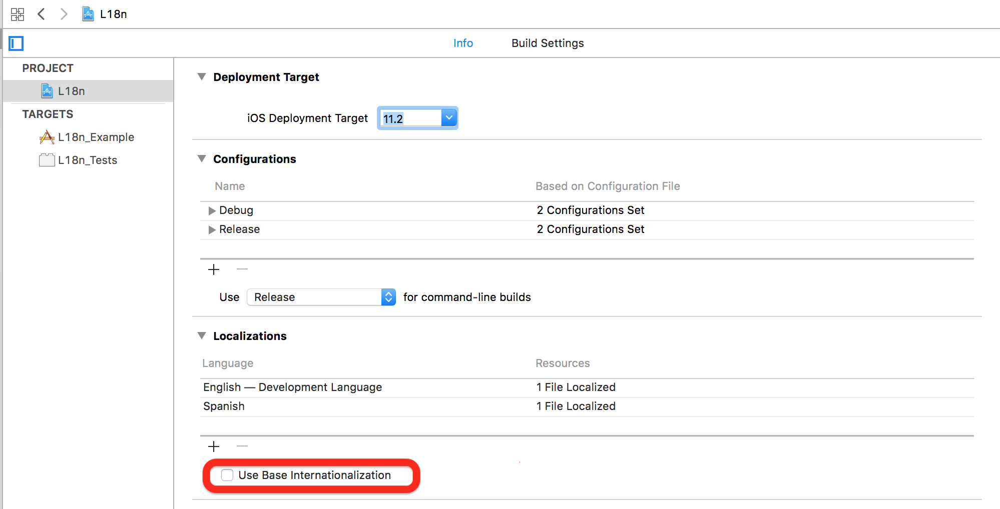</img>

Your storyboard does not need to be split by each localization languages, you can leave by default like the image bellow to avoid manage multiple copies of same storyboard

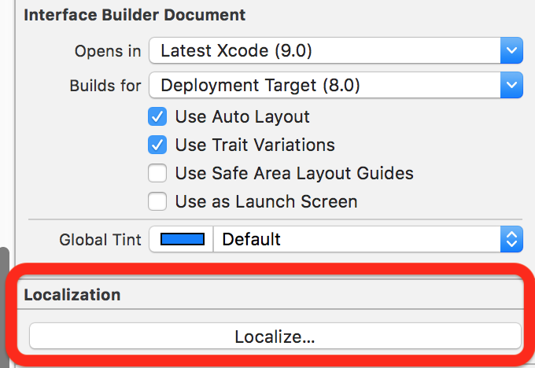</img>


## Example

To run the example project, clone the repo, and run `pod install` from the Example directory first.


# How to use iOS-L10n on Storyboard

**All storyboard objects expose the following fields in the inspector attributes**

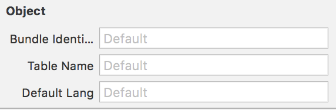</img>

* **Bundle Identifier**: This field allows you to create an instance of the bundle with the given identifier, the resulting bundle is used for the localization, if you do not define an identifier `Bundle.main` is used by default
* **Table Name**: It allows to define which table to use in the localization, if a value is not defined, `Localizable`  is used by default
* **Default Lang**: Allows you to define a base language, in case there is no key that you want to localize in the current language of the phone, we will use the default language, by default we use `en` (for English` en.lproj`)


### Subclasses of UIBarItem

Attributes inspector allows to define the key associated with the title of the element

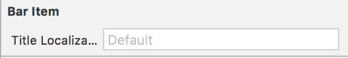</img>


### UIButton

Attributes inspector allows to define the keys associated with the `title` of the button for each possible state` normal`, `highlighted`,` selected`, `disabled`
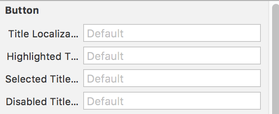</img>

### UILabel
Attributes inspector allows to define the key associated with the title of the label

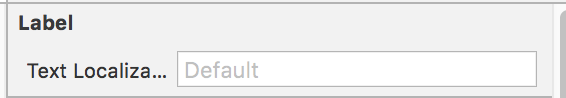</img>

### UINavigationItem

Attributes inspector allows to define the keys associated with the `title` and` prompt` of the element

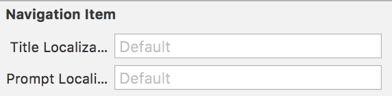</img>

### UISearchBar

Attributes inspector allows to define the keys associated with `title`,` placeholder` and `prompt`

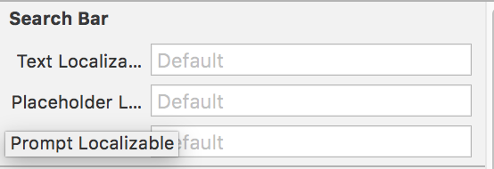</img>


Attributes inspector allows to define the keys associated with the titles of the segments, each key is defined separated by `,`

### UISegmentedControl

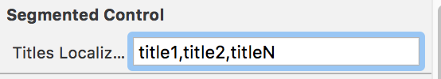</img>

### UITextField

Attributes inspector allows to define the keys associated with the `text` and` placeholder`

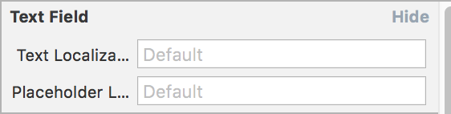</img>

### UIViewController

Attributes inspector allows to define the keys associated with the title of the ViewController and the title of the element associated with the tab bar

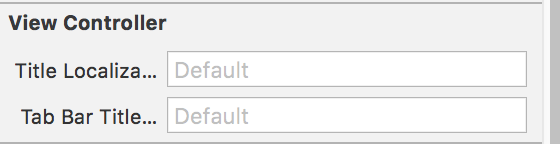</img>

# How to use iOS-L10n on Source Code

Define your Strings

**MessagesStrings.strings**

````strings
"welcome_message_key" = "Welcome to use iOS-L10n %@ %@";
"bye_message_key" = "See you soon";

````

Create some type (enums prefered) that conform to **iOS-L10n**

**MessagesStrings.swift**

````swift

	import iOS-L10n
	
	enum MessagesStrings: String, iOS-L10n{
		case welcomeMessage = "welcome_message_key" 
		case byeMessage = "bye_message_key"
		
		//var tableName: String = "TableName" //If no defined on code iOS-L10n will infer the table name using the same name that this instance 'MessagesStrings'
		//baseLanguage: String = "es" // If no defined iOS-L10n will use by default 'en'
		//bundle: Bundle = MiFramework.bundle // If no defined iOS-L10n will use by default 'Bundle.main'
		
		// Return the localization value based on self, If no defined iOS-L10n will return the localized value based on this instance's values
		//public var localized: String {
       // return rawValue.localized(bundle: self.bundle, tableName: self.tableName, baseLanguage: self.baseLanguage)
    	//}
	}
````

Use the instance conforming to **iOS-L10n**

````swift

	let welcomeMessage = MessagesStrings.localize(.welcomeMessage, ["Mr.", "iOS Developer"])
	print(welcomeMessage) //Will print "Welcome to use iOS-L10n Mr. iOS Developer"
	
	let byeMessage = MessagesStrings.localize(.byeMessage)
	print(byeMessage) //Will print "See you soon"
	
	let byeMessageAlt = MessagesStrings.byeMessage.localized
	print(byeMessageAlt) //Will print "See you soon"

````

## Requirements

  - iOS 8+
  - Swift 4.0

# Installation 

### CocoaPods

iOS-L10n is available through [CocoaPods](http://cocoapods.org). To install
it, simply add the following line to your Podfile:

```ruby
pod 'iOS-L10n'
```


## Author

Dani Manuel Céspedes Lara, dmanuelcl@gmail.com

## License

iOS-L10n is available under the MIT license. See the LICENSE file for more info.
